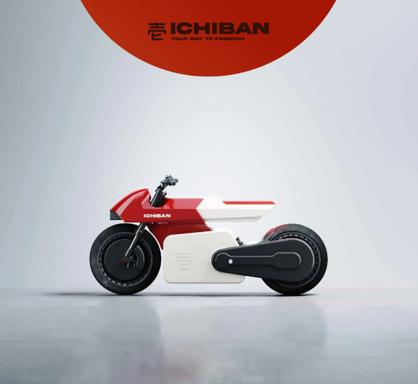

# 🏍️ Scroll Image Sequence

<p align="center">
  
</p>

<p align="center">
  
  
  
  
  
</p>

<p align="center">
  <a href="https://github.com/alobuuls/scroll-image-sequence" target="_blank">
    
  </a>
  <a href="https://github.com/alobuuls/scroll-image-sequence/stargazers" target="_blank">
    
  </a>
  <a href="https://github.com/alobuuls/scroll-image-sequence/commits/main" target="_blank">
    
  </a>
</p>

---

## 📑 Table of Contents

- [🏍️ Scroll Image Sequence](#️-scroll-image-sequence)
  - [📑 Table of Contents](#-table-of-contents)
  - [📖 Description](#-description)
  - [⚙️ System Requirements](#️-system-requirements)
  - [🔍 Verify Installation](#-verify-installation)
  - [🚀 Project Installation](#-project-installation)
    - [1️⃣ Clone the repository](#1️⃣-clone-the-repository)
    - [2️⃣ Open the project](#2️⃣-open-the-project)
  - [▶️ Run the Project](#️-run-the-project)
  - [🧠 Project Architecture](#-project-architecture)
    - [📦 Core Modules](#-core-modules)
      - [Scroll Engine](#scroll-engine)
      - [Image Sequence System](#image-sequence-system)
      - [Animation Controller](#animation-controller)
  - [✨ Features](#-features)
  - [🛠 Technologies Used](#-technologies-used)
  - [📁 Project Structure](#-project-structure)
  - [🔥 Best Practices Implemented](#-best-practices-implemented)
  - [🎯 Project Goal](#-project-goal)
  - [📄 License](#-license)

---

## 📖 Description

> [!NOTE]
> Scroll Image Sequence is a browser-based animation project built with vanilla JavaScript.

The application creates a frame-by-frame animation controlled entirely by the user's scroll position, generating a smooth cinematic effect similar to those used in modern landing pages and product showcases.

---

## ⚙️ System Requirements

Before running the project, make sure you have:

* 🌐 A modern web browser (Chrome, Firefox, Edge, Safari)
* 📦 Git (optional)

---

## 🔍 Verify Installation

Check that Git is installed:

```bash
git --version
```

---

## 🚀 Project Installation

### 1️⃣ Clone the repository

```bash
git clone git@github.com:alobuuls/scroll-image-sequence.git
cd scroll-image-sequence
```

### 2️⃣ Open the project

> [!IMPORTANT]
> No dependencies or package installation are required.

You can simply open:

```text
index.html
```

or run the project using Live Server in Visual Studio Code.

---

## ▶️ Run the Project

Open the `index.html` file directly in your browser or start a local development server.

---

## 🧠 Project Architecture

> [!NOTE]
> The application is built using vanilla JavaScript, CSS animations, and image sequence rendering.

### 📦 Core Modules

#### Scroll Engine

Responsible for:

* Tracking scroll position
* Calculating scroll progress
* Mapping scroll percentage to frames
* Updating rendered images

#### Image Sequence System

Handles:

* Frame loading
* Frame preloading
* Image switching
* Sequence synchronization

#### Animation Controller

Manages:

* Initial frame rendering
* Scroll restoration behavior
* Responsive recalculations
* Visual transitions

---

## ✨ Features

* 🎬 Frame-by-frame image sequence animation
* 🖱️ Scroll-driven playback
* ⚡ Image preloading for smooth rendering
* 📱 Responsive behavior
* 🔄 Automatic frame synchronization
* 🚀 Fast image updates using CSS backgrounds
* 🎨 Intro logo animation
* 📈 Dynamic scroll-to-frame calculation
* 🧠 Optimized rendering by avoiding duplicate frame updates

---

## 🛠 Technologies Used

| Technology                   | Purpose          |
| ---------------------------- | ---------------- |
| HTML5                        | Structure        |
| CSS3                         | Styling          |
| JavaScript (ES6+)            | Logic            |
| DOM API                      | DOM Manipulation |
| Intersection & Scroll Events | Scroll Handling  |
| WebP Images                  | Optimized Frames |

---

## 📁 Project Structure

```text
scroll-image-sequence/
├── index.html
├── styles.css
├── main.js
├── images/
│   ├── logo.png
│   ├── preview.gif
│   └── frames/
│       ├── moto-001.webp
│       ├── moto-002.webp
│       ├── ...
│       └── moto-151.webp
└── README.md
```

---

## 🔥 Best Practices Implemented

* Separation of responsibilities
* Image preloading strategy
* Efficient frame rendering
* Scroll position normalization
* Responsive recalculation on resize
* Avoiding unnecessary DOM updates
* Reusable utility functions
* Clean and maintainable code structure

---

## 🎯 Project Goal

Practice and strengthen advanced JavaScript concepts through a visual animation project:

* Scroll-based interactions
* Frame sequence animations
* Image preloading techniques
* DOM manipulation
* Event handling
* Performance optimization
* Responsive development
* Modern landing page effects

---

## 📄 License

> [!NOTE]
> This project is intended for educational purposes and is part of a personal portfolio.
